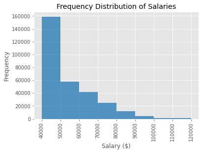

# SQL - Challenge

---

## Background

It is a beautiful spring day, and it is two weeks since you have been hired as a new data engineer at Pewlett Hackard. Your first major task is a research project on employees of the corporation from the 1980s and 1990s. All that remain of the database of employees from that period are six CSV files.

## Data Engineering

This schema was built using [QuickDatabaseDiagrams](https://app.quickdatabasediagrams.com/). CSV files used for the project may be found in the respective 'data' directory within 'EmployeeSQL'. Once schema design was completed, the table schema was exported to PostgreSQL, and individual table data imported from respective CSV file. Table schema .sql file may be found in 'Employee SQL' directory (Employee_DB_Schemata.sql).

---
## Data Analysis & Visualization
After database construction complete perform some basic queries. Query file may be found in 'EmployeeSQL' directory (employee_db_queries.sql).

### Queries

* List the following details of each employee: employee number, last name, first name, sex, and salary.

* List first name, last name, and hire date for employees who were hired in 1986.

* List the manager of each department with the following information: department number, department name, the manager's employee number, last name, first name.

* List the department of each employee with the following information: employee number, last name, first name, and department name.

* List first name, last name, and sex for employees whose first name is "Hercules" and last names begin with "B."

* List all employees in the Sales department, including their employee number, last name, first name, and department name.

* List all employees in the Sales and Development departments, including their employee number, last name, first name, and department name.

* In descending order, list the frequency count of employee last names, i.e., how many employees share each last name.

### SQLalchemy

As you examine the data, you are overcome with a creeping suspicion that the dataset is fake. You surmise that your boss handed you spurious data in order to test the data engineering skills of a new employee. To confirm your hunch, you decide to use python to generate visualizations of the data, with which you will confront your boss:

#### Histograms of Salary

#### Average Salaries

#### Salary Distribution by Job Title

From this analysis we can safely say that the data is a little too 'normal'. The histograms illustrate a near perfect right side to a bell curve and the average salaries by job title are nearly identical as well. If this were a real dataset we would excpect more character on the violin plot as well. A company of 300k+ employees should have a healthy middle and upper management tier for compensation, and all we really see is most employees sitting around the $40k mark, and few if any moving up the compensation ladder. 

#### My Information
A quick query on my own hypothetical employee number confirms the sad normality of the data:

---
## Resources

* [QuickDatabaseDiagrams](https://app.quickdatabasediagrams.com/)
* [PostgreSQL](https://www.postgresql.org/)
* [SQLalchemy](https://www.sqlalchemy.org/)

---
## Dependancies

* os
* matplotlib
* pandas
* numpy
* sqlalchemy
* dotenv
* seaborn
* dataframe_image